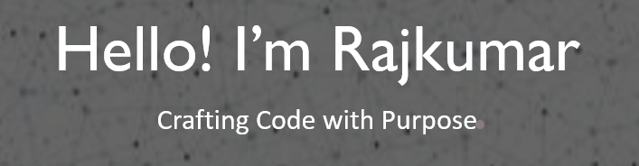

  

 

I'm a **self-taught, passionate Full Stack Engineer** based in **Chennai, India 🇮🇳** who thrives on building impactful and scalable software.

### 🚀 About Me

- 💼 **Director of Engineering** at [Applied Data Finance](https://applieddatafinance.com/), a US-based fintech product company. I lead engineering efforts for large-scale cloud-native platforms focused on **real-time credit underwriting**, **loan servicing systems**, and **financial risk analytics**. My work spans team leadership, system design, architectural modernization, and product delivery at scale.

- 🛠️ Creator of open source tools like [**github-readme-stats**](https://github.com/rkoots/github-readme-stats) — used by thousands of developers to enhance their GitHub profiles — and [**verlyjs**](https://github.com/rkoots/verlyjs), a lightweight JavaScript physics engine. Combined, my projects have received **50M+ views**, **50K+ GitHub stars**, and are integrated into a wide range of developer tooling, dashboards, and learning resources.

- 💡 I enjoy designing **scalable backend systems** (Node.js, GraphQL, event-driven services), crafting **responsive frontends** (React, Next.js), and experimenting with **type-level TypeScript** to push the boundaries of safety and expressiveness in code. I’m passionate about **developer experience**, clean architecture, and building tools that simplify complex problems.

- ⚙️ I regularly work with technologies like **Docker**, **Kubernetes**, **PostgreSQL**, **Redis**, **MongoDB**, **GitHub Actions**, and **CI/CD automation** — building systems that are resilient, observable, and performant.

- 📫 Open to collaboration, mentorship, and meaningful conversations around software architecture, open source, or new ideas. Drop a question or say hi via [GitHub Discussions](https://github.com/rkoots/rkoots/issues) or connect via my [portfolio](https://rkoots.github.io).

### 🧠 Tech I Enjoy Working With

<code></code>
<code></code>
<code></code>
<code></code>
<code></code>

---

### 📊 GitHub Stats

|  |  |
|--------------------------------------------------------------------------------------------------------------------------------------------------------------------------------------------------------|--------------------------------------------------------------------------------------------------------------------------------------------------------------------------------------------------------|

---

### 📌 Featured Repositories

---

### 🔗 Connect With Me

